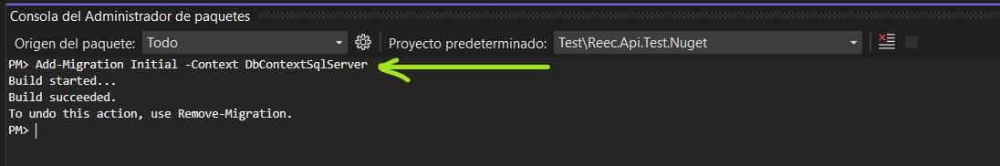

# Reec
Paquetes para realizar conversiones de tipos de datos génericos, obtener tipo de ContentType apartir de un nombre de archivo. 
Alto rendimiento en conexión a base de datos de manera nativa y de fácil uso en SqlServer, Oracle, MySql.
Paquete de inspección de errores automáticos en WebApi para SqlServer, permite generar un Id de seguimiento.
Se agregaran más conexiones de base de datos próximamente.

## Comenzando 🚀 

_Estas instrucciones te permitirán obtener una copia del proyecto en funcionamiento en tu máquina local._


### Pre-requisitos 📋 
```PowerShell
Install-Package Reec.Helpers
Install-Package Reec.MySql
Install-Package Reec.Oracle
Install-Package Reec.SqlServer
Install-Package Reec.Inspection.SqlServer
```

### Uso del paquete Reec.Helpers 🔧 
```csharp
using Reec.Helpers;
.
.
.
// Convierte un DataReader en un objeto genérico. Si el número de filas es diferente a 1, retornará null.
var entity = HelperConvert.DataReaderToEntity<TEntity>(dataReader);

//Convierte un DataReader a una lista genérica, si no hay ninguna propiedad que haga match, retornará null.
var listEntity = HelperConvert.DataReaderToList<TEntity>(dataReader);

//Convierte un dataReader genérico a DataTable
var dataTable = HelperConvert.DataReaderToDataTable(dataReader);

var dataSet = HelperConvert.DataReaderToDataSet(dataReader);

//Convierte una lista genérica en un DataTable
var dataTable = HelperConvert.ListEntityToDataTable(listEntity);
var dataTable1 = HelperConvert.ListEntityToDataTable(listEntity, "propiedad1", "propiedad2", "propiedad3");


//El valor de contentTypePdf = "application/pdf"
var contentTypePdf = HelperContentType.GetContentType("test.pdf");

//El valor de contentTypeXlsx = "application/vnd.openxmlformats-officedocument.spreadsheetml.sheet"
var contentTypeXlsx = HelperContentType.GetContentType("test1.xlsx");
```


### Uso del paquete Reec.SqlServer 🔧 

```csharp
using Reec.SqlServer;
.
.
.
using ReecSqlServer reecSqlServer = new ReecSqlServer("cadena de conexión");
var dataTable = reecSqlServer.QueryToDataTable("select * from Table1");

//Ejecuta un script de sql y retorna el número de las filas afectadas. Insert, Delete, Update
var rowsAffected = reecSqlServer.QueryRowsAffected("update [Tabla1] set columna1 = 'prueba' where Id = 1");


//Ejecuta un StoreProcedure y retorna el número de filas afectadas, envío de parametros nativos
var rowsAffected1 = reecSqlServer.ExecuteNonQuery("Name_StoreProcedure",
                       new SqlParameter("@param1", 1),
                       new SqlParameter("@param2", "prueba SP 3"));


//Ejecuta un StoreProcedure y retorna el número de filas afectadas.
var rowsAffected2 = reecSqlServer.ExecuteNonQuery("Name_StoreProcedure");

//Ejecuta un StoreProcedure y retorna un DataReader.
var dataReader = reecSqlServer.ExecuteReader("Name_StoreProcedure");

//Ejecuta un StoreProcedure y retorna un DataSet. Si el StoreProcedure no retorna filas, la función retorna null.
var dataSet = reecSqlServer.ExecuteToDataSet("Name_StoreProcedure")

//Ejecuta un StoreProcedure y retorna un ListEntity. Si el StoreProcedure no retorna filas, la función retornara null.
var listEntity = reecSqlServer.ExecuteToListEntity<TEntity>("Name_StoreProcedure");


///Uso de transacciones, se recomienda usar using al declarar la variable.
using var transaction = reecSqlServer.BeginTransaccion();

//ejemplo de parametro de salida.
var count = new SqlParameter("@count", System.Data.SqlDbType.Int) { 
        Direction = System.Data.ParameterDirection.Output };
var vResult = reecSqlServer.ExecuteNonQuery("USP_Curso_Update",
                    new SqlParameter("@IdCurso", 1),
                    new SqlParameter("@Nombre", "asp.net core MVC"),
                    new SqlParameter("@Activo", true),
                    count);

var cursosT = reecSqlServer.QueryToListEntity<Curso>("select * from [dbo].[Curso]");
/*
  código insert ..
  código delete ..
  código update ..
  código select ..
*/

if(condicion)//alguna regla de negocio para ejecutar el Rollback, si ocurre una excepción, el rollback se ejecuta en automático.
{
  transaction.Rollback();
}


transaction.Commit();

```


### Uso del paquete Reec.Inspection.SqlServer 🔧 

- Las migraciónes estan habilitados en automático y tiene soporte para EF core 3.1
- El [script](https://github.com/edychumpitaz/Reec/blob/master/scripts/LogHttp.sql) de contingencia para creación de tabla de LogHttp.
- Documentación en [Excel](https://github.com/edychumpitaz/Reec/blob/master/documents/Documentacion%20de%20error.xlsx)
- Para Net5 y Net6 se debe aplicar una nueva migración. ejemplo: "Add-Migration"


_Configuración del Startup._
```csharp
using Reec.Inspection;
using Reec.Inspection.SqlServer;
public void ConfigureServices(IServiceCollection services)
{
    services.AddReecException<DbContextSqlServer>(options =>
                 options.UseSqlServer("cadena de conexión"));

}

 public void Configure(IApplicationBuilder app, IWebHostEnvironment env)
{
    ///Debe ser el 1er middleware agregado para inspeccionar los log.
    app.UseReecException<DbContextSqlServer>();
}
```

_Deshabilitar las migraciones._
```csharp
services.AddReecException<DbContextSqlServer>(options =>
                          options.UseSqlServer("cadena de conexión"), new ReecExceptionOptions
                          {
                              EnableMigrations = false
                          });
```


_Habilitar migración para Net5 y Net6_

Dependencia Nuget para aplicar migración
```PowerShell
Install-Package Microsoft.EntityFrameworkCore.Tools
```

Ejecutar comando en la consola del administrador de paquetes
```PowerShell
Add-Migration Initial -Context DbContextSqlServer
```


```csharp
services.AddReecException<DbContextSqlServer>(options =>
                         options.UseSqlServer("cadena de conexión", x => x.MigrationsAssembly(typeof(Startup).Namespace)));
```


_Formas de uso de error controlado._
```csharp
using static Reec.Inspection.ReecEnums; /// obtener enums de categorias de mensajes
.
.
[HttpGet]
public IActionResult TestWarning(string parameter)
{
    // Error controlado de validación de datos
    if (string.IsNullOrWhiteSpace(parameter))
        throw new ReecException(Category.Warning, "Campo 'parameter' obligatorio.");

    return Ok(parameter);
}

[HttpGet]
public IActionResult TestInternalServerError(string parameter)
{
    var numerador = 1;
    var denominador = 0;    
    // Error no controlado del sistema. produce un error 500 del servidor.
    // El error que retorna a la api: {"Id":3,"Path":"/weatherforecast/TestInternalServerError/1","TraceIdentifier":"8000001b-0002-ff00-b63f-84710c7967bb","Category":500,"CategoryDescription":"InternalServerError","Message":["Error no controlado del sistema."]}
    var division = numerador / denominador;
    return Ok(parameter);
}

public IActionResult TestBusinessLogic(string parameter)
{
    if (string.IsNullOrWhiteSpace(parameter))
        throw new ReecException(Category.BusinessLogic, "No cumple con la regla de negocio.");
    return Ok(parameter);
}

public IActionResult TestBusinessLogicLegacy(string parameter)
{
    try 
    {
        var numerador = 1;
        var denominador = 0;
        var division = numerador / denominador;
        return Ok(parameter);
    }
    catch (Exception ex)
    {
        throw new ReecException(Category.BusinessLogicLegacy, "Error no controlado del sistema legacy 'app1'.", ex.Message);
    }
}
```


Tipos de Response Reec.Inspection.SqlServer
```csharp

//Response Warning - HttpStatus 400
{"Id":6,"Path":"/weatherforecast/TestWarning","TraceIdentifier":"80000007-0004-ff00-b63f-84710c7967bb","Category":460,"CategoryDescription":"Warning","Message":["Campo 'parameter' obligatorio."]}


//Response BusinessLogic - HttpStatus 400
{"Id":7,"Path":"/weatherforecast/TestBusinessLogic","TraceIdentifier":"80000008-0004-ff00-b63f-84710c7967bb","Category":465,"CategoryDescription":"BusinessLogic","Message":["No cumple con la regla de negocio."]}


//Response BusinessLogicLegacy - HttpStatus 400
{"Id":8,"Path":"/weatherforecast/TestBusinessLogicLegacy","TraceIdentifier":"80000009-0004-ff00-b63f-84710c7967bb","Category":470,"CategoryDescription":"BusinessLogicLegacy","Message":["Error no controlado del sistema legacy 'app1'."]}


//Response InternalServerError - HttpStatus 500
{"Id":9,"Path":"/weatherforecast/TestInternalServerError/1","TraceIdentifier":"8000000d-0004-ff00-b63f-84710c7967bb","Category":500,"CategoryDescription":"InternalServerError","Message":["Error no controlado del sistema."]}

```


